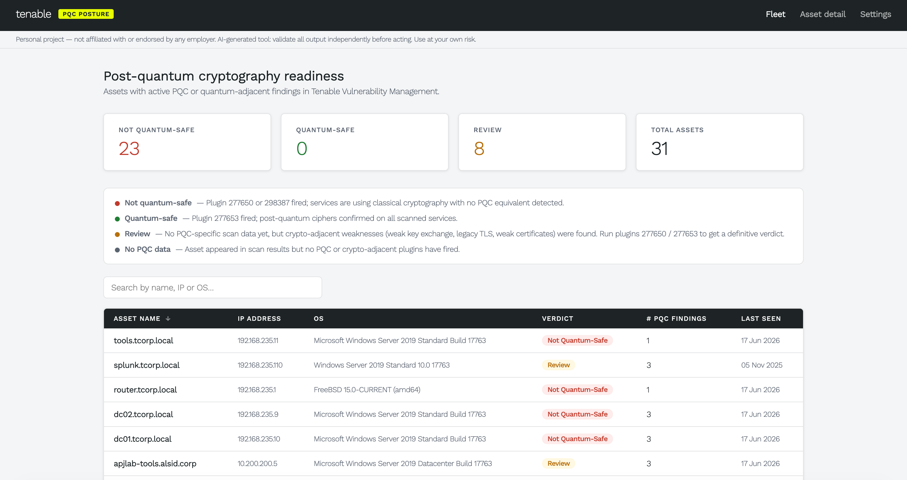
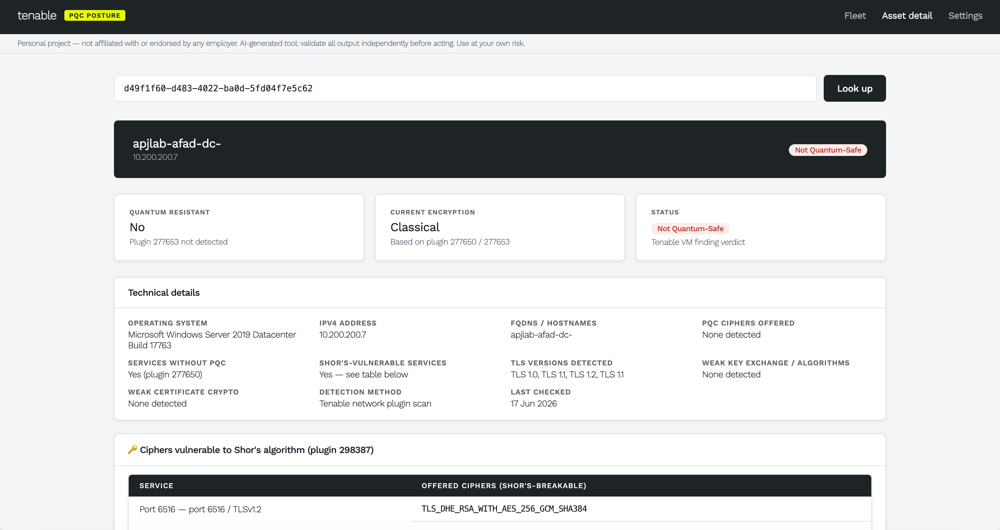

# PQC Posture

Post-Quantum Cryptography readiness dashboard for Tenable Vulnerability Management (Tenable.io).

## Screenshots

**Fleet view** — summary tiles (Not Quantum-Safe / Quantum-Safe / Review / Total Assets) with a searchable asset table showing each host's verdict, PQC finding count, and last-seen date.



**Asset detail** — per-host breakdown showing quantum-resistance status, current encryption method, technical details (OS, IPv6, FQDNs, TLS versions, weak services), and a table of ciphers vulnerable to Shor's algorithm detected by plugin 298387.



## Quick start

### Prerequisites

- [Python 3.9+](https://www.python.org/downloads/)
- [Git](https://git-scm.com/downloads) — or just download the ZIP from GitHub

### Step 1 — Get the code

**Option A: Git clone**
```bash
git clone https://github.com/knethteo/pqc-posture.git
cd pqc-posture
```

**Option B: Download ZIP**  
Click **Code → Download ZIP** on GitHub, unzip it, then open a terminal inside the `pqc-posture` folder.

### Step 2 — Create a virtual environment

**Mac / Linux**
```bash
python3 -m venv .venv
source .venv/bin/activate
```

**Windows — Command Prompt**
```bat
python -m venv .venv
.venv\Scripts\activate
```

**Windows — PowerShell**
```powershell
python -m venv .venv
.venv\Scripts\Activate.ps1
```

### Step 3 — Install dependencies

```bash
pip install -r requirements.txt
```

### Step 4 — Configure your API keys

**Mac / Linux**
```bash
cp .env.example .env
```

**Windows**
```bat
copy .env.example .env
```

Open the `.env` file in any text editor and replace the placeholder values with your Tenable API keys:
```
TIO_ACCESS_KEY=your_tenable_access_key_here
TIO_SECRET_KEY=your_tenable_secret_key_here
```

> Don't have keys yet? Skip this step — the app will redirect you to the in-app setup page at http://localhost:8000/setup where you can enter them.

### Step 5 — Run the app

```bash
uvicorn main:app --reload --port 8000
```

Open http://localhost:8000

## Docker (alternative to Quick Start)

If you have [Docker](https://www.docker.com/get-started/) installed, you can skip the Python/venv setup entirely and run the app in a container instead.

Make sure you've completed Step 4 (configure your `.env` file) first, then:

```bash
docker build -t pqc-posture .
docker run -p 8000:8000 --env-file .env pqc-posture
```

## API keys

Keys are read from environment variables `TIO_ACCESS_KEY` / `TIO_SECRET_KEY` (via `.env` or Docker `--env-file`).  
You can also enter them via the in-app setup page — they are stored locally in `.tio_keys` (gitignored) and never sent to the browser.

## Endpoints

| Method | Path | Description |
|--------|------|-------------|
| GET | `/` | Fleet overview (Page 1) |
| GET | `/asset?uuid=<uuid>` | Asset detail (Page 2) |
| GET | `/setup` | API key setup |
| GET | `/api/pqc-assets` | JSON: all at-risk assets |
| GET | `/api/asset/{uuid}` | JSON: full PQC detail for one asset |
| GET | `/api/status` | JSON: whether keys are configured |
| POST | `/api/auth` | Set API keys at runtime |

## PQC plugin set

Configured in `main.py` as `PLUGINS` — a single dict grouped by category. Edit it there to add/remove plugin IDs.

## Verdict logic

Each asset is assigned one of four verdicts based solely on which Nessus plugins fired. The two decisive plugins are **277650** (Remote Services *Not* Using Post-Quantum Ciphers) and **277653** (Remote Services *Using* Post-Quantum Ciphers). Plugin **298387** (Shor's Harvest Now Decrypt Later) is treated as an additional not-safe signal equivalent to 277650.

| Verdict | Color | Condition |
|---|---|---|
| **Not Quantum-Safe** | Red | 277650 or 298387 fired **and** 277653 did not. At least one service confirmed using classical cryptography only. |
| **Quantum-Safe** | Green | 277653 fired **and** neither 277650 nor 298387 fired. All scanned services offer post-quantum ciphers. |
| **Review** | Amber | (1) Both a not-safe signal (277650 or 298387) and 277653 fired — partial PQC adoption, some services still classical. OR (2) No core PQC plugins fired, but crypto-adjacent weakness plugins (weak key exchange, legacy TLS, weak certificates) were found — quantum posture unknown until 277650/277653 scan this asset. |
| **No PQC data** | Grey | No core PQC plugins (277650–277654, 298387) and no crypto-adjacent weakness plugins have fired. Asset appeared in scan results for an unrelated reason. Quantum posture completely unknown. |

### Why "Review" covers two different situations

The first Review trigger (partial PQC) means the asset has mixed coverage — some services are already hardened, but others are still reachable with classical crypto. The second (no PQC scan yet) means the PQC-specific plugins simply haven't run against this asset yet. In both cases a definitive verdict requires either 277650 or 277653 to fire without the other.

## Caching

Workbench calls are cached in memory for 10 minutes. Cache is cleared when new API keys are set. Restart the server to force a full refresh.

## Data source

All findings are sourced from Tenable Vulnerability Management via the Workbench API. No data is fabricated. Truncated plugin outputs are flagged with a link to the Tenable console.
